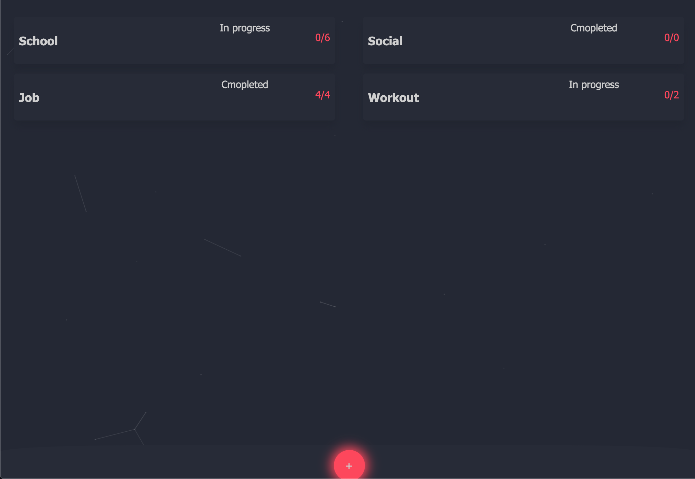

# KickTask



React application based google firebase in order to manage tasks & users. 

## Config

Go to firebase to genearte your own config

```javascript
var firebaseConfig = {
  "use your own config"
};
```

## To run application 

From the root directory

```bash
npm install
npm start
```
